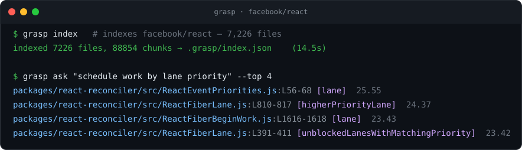
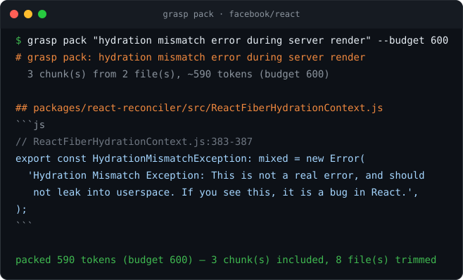
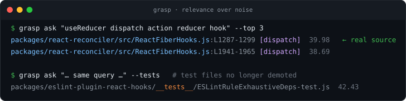
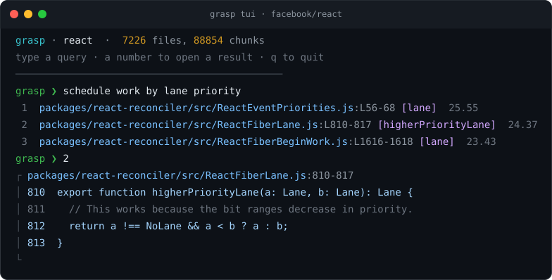

# grasp

Give any AI coding agent a grasp on a codebase too big to fit in its context window.

Agents don't fail because they're dumb; they fail because a real repo doesn't fit in one prompt, and hand-picking the right files for every task doesn't scale past a few thousand lines. `grasp` indexes a repository once — symbols, imports, an import graph, a BM25 text index — and then, for whatever task you or the agent describes, hands back only the slice of code that's actually relevant, sized to a token budget. Point it at a monorepo and ask a question instead of grepping around or dumping half the tree into context.

It works two ways: as a CLI you can run by hand or wire into a shell pipeline, and as an MCP server so Claude Code, Cursor, Codex, or any other MCP-speaking agent can pull context on demand instead of you doing it for them.

## See it work

Pointed at [`facebook/react`](https://github.com/facebook/react) — **7,226 files, 88,854 chunks, indexed in ~15 seconds** — and asked a question in the code's own vocabulary, it returns the real reconciler source, not the thousands of tests that mention those words:



`grasp pack` goes further and hands back the actual source, budgeted to fit a prompt — here, the genuine hydration-mismatch error pulled out of a 7k-file tree into ~590 tokens:



Test, fixture, snapshot, and example files are demoted by default so the implementation rises above the noise; pass `--tests` to include them at full weight:



## Install

```sh
npm i -g @zent7x/grasp
```

or run it without installing:

```sh
npx @zent7x/grasp index
```

Requires Node 18 or newer. Zero runtime dependencies — the whole thing is built on `node:fs`, `node:path`, `node:crypto`, and friends.

## Quickstart

Run these from inside the repo you want grasp to understand.

```sh
grasp index
```

Walks the repo (honoring `.gitignore`, skipping binaries), extracts symbols and imports per file, chunks each file, builds a BM25 index and an import graph, and writes it all to `.grasp/index.json`. Re-run it after significant changes; nothing keeps it live-updated automatically.

```sh
grasp ask "add rate limiting to the login route"
```

Ranks every chunk in the index against your task and prints `path:Lstart-Lend [symbol] score` for the top matches — BM25 relevance, boosted when a query term matches a symbol name and again when a top result's file is graph-adjacent to another. Test, fixture, snapshot, and example files are demoted so real source ranks first. Add `--top N` to change how many come back, `--json` for structured output, and `--tests` to rank test/fixture files at full weight instead of demoting them.

```sh
grasp pack "add rate limiting to the login route" --budget 8000 --out context.md
```

Same ranking, but instead of a list you get a single Markdown bundle with the actual source of the top-ranked chunks, greedily packed until the token budget runs out. This is the thing you paste into a prompt, or that `grasp_pack` returns over MCP. Drop `--out` to print to stdout.

```sh
grasp outline
grasp outline src/api
```

A compact, directory-grouped symbol tree — every function, class, and const grasp found, with line ranges, no bodies. Good for getting oriented before you ask anything.

```sh
grasp stats
```

File count, chunk count, and a language breakdown for the current index.

### Interactive mode

```sh
grasp tui
```

An interactive search shell. Type a query to rank the codebase, a result number to open that chunk's source inline, `p <query>` to pack the top results, and `q` to quit. Output is colorized on a TTY (set `NO_COLOR=1` to turn it off; `ask`, `stats`, and `index` colorize too).



## MCP

Start the server with `grasp serve` from the repo root; it builds the index on first launch if one doesn't already exist, then speaks newline-delimited JSON-RPC 2.0 over stdio. A typical client config:

```json
{
  "mcpServers": {
    "grasp": {
      "command": "grasp",
      "args": ["serve"],
      "cwd": "/absolute/path/to/repository"
    }
  }
}
```

Five tools are exposed:

- `grasp_search` — rank the repo against a query, return `path:Lstart-Lend` locations.
- `grasp_outline` — symbol outline for a file, a subtree, or the whole repo.
- `grasp_read` — line-numbered source, by explicit range or by symbol name.
- `grasp_neighbors` — the import graph around a file: what it imports, what imports it.
- `grasp_pack` — the same ranking as `grasp_search`, rendered as a token-budgeted Markdown bundle of actual source.

An agent can call `grasp_search` or `grasp_pack` to get its bearings on a task, then `grasp_read` or `grasp_neighbors` to follow a thread — all without you manually attaching files.

## How it works

Indexing is a straight pipeline: walk the tree respecting `.gitignore` and a binary/size filter, detect each file's language, extract symbols and import specifiers with per-language regex rules, chunk each file along symbol boundaries (splitting anything longer than the configured max), then build a BM25 index over chunk text and a resolved import graph over the whole set. Ranking scores query tokens against that BM25 index, adds a fixed boost when a token matches a chunk's symbol name, and a smaller boost when a top-scoring chunk's file sits next to another top result in the import graph — never inventing a result that didn't already have a text match. As a final re-rank, files that live in test/fixture/snapshot/example trees are multiplied down so the implementation outranks the many files that merely mention it (turn this off with `--tests`). Everything is deterministic: same repo, same task, same output, every time. No embeddings, no model calls, no network access — the whole index lives in one JSON file you can inspect, diff, or delete.

## Limitations

This is lexical and structural retrieval, not semantic search. `grasp` finds code by matching tokens, symbol names, and import relationships — it doesn't know that "auth" and "login" mean roughly the same thing unless both words show up somewhere relevant. For most agentic coding tasks, where the task description tends to share vocabulary with the code, that's plenty, and it's fast and fully offline. The place it strains is when you search for a public API name whose implementation uses different internal names — e.g. React's `useState` lives in code that mostly says `mountState`/`dispatchSetState`, so a literal "useState" query leans on the files that spell it out. Test-file demotion helps a lot here, but it's exactly the gap an embedding index closes. Embedding-based retrieval, and an optional passthrough to a semantic tool like `cogrep`, are on the list for a future version — v0.1 is intentionally just BM25 plus graph, because that's the part that's easy to get right, verify, and keep dependency-free.

## Programmatic API

```js
import { buildIndex, query, pack, rank, outlineRepo, outlineFile, loadIndex, saveIndex } from '@zent7x/grasp';

const root = process.cwd();
const index = await buildIndex(root);
const { results } = await query(root, 'trace the login flow', { top: 10 });
const bundle = await pack(index, root, 'trace the login flow', { budget: 8000 });
```

## License

MIT

---

Built by Adeeb Bashir (zentex) · [zent7x.com](https://zent7x.com)
